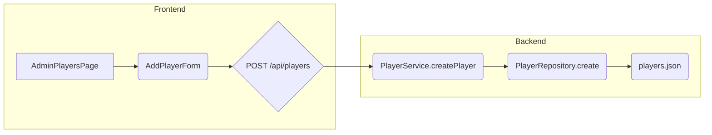

# Add Player Implementation Plan

This document outlines the plan to implement the "Add Player" functionality in the web application.

## Overview

The "Add Player" feature will allow administrators to add new players to the system through the admin interface. This involves creating a new API endpoint, service method, repository method, and a frontend component for the add player form.

## Backend Changes

### 1. API Endpoint

*   **Method:** `POST`
*   **Path:** `/api/players`
*   **Request Body:** `CreatePlayerInput` (name, iscUsername, initialRating, initialCategory)
    ```typescript
    interface CreatePlayerInput {
      name: string;
      iscUsername?: string;
      initialRating?: number;
      initialCategory?: PlayerCategoryType;
    }
    ```
*   **Response:** The newly created `Player` object (or at least id, name, and initial rating).
*   **File:** `src/app/api/players/route.ts` (This file already exists for `GET /api/players`, so we'll add a POST handler to it.)

### 2. Service Method

*   **Service:** `PlayerService`
*   **Method Name:** `createPlayer`
*   **Parameters:** `CreatePlayerInput` object.
*   **Logic:**
    1.  Validate the input (ensure the name is not empty and is unique).
    2.  Generate a unique player ID.
    3.  Create a new `Player` object, using default values for `currentRating` and `category` if not provided in the input.
        ```typescript
        import { Player, CreatePlayerInput, PLAYER_CONSTANTS } from '@/types/Player';
        import { PlayerCategoryType } from '@/types/Enums';
        import { v4 as uuidv4 } from 'uuid';

        // ... inside PlayerService class

        createPlayer(input: CreatePlayerInput): Player {
          // 1. Validate input
          if (!input.name) {
            throw new Error("Player name is required.");
          }
          // Add uniqueness check (implementation depends on repository)

          // 2. Generate unique ID
          const id = uuidv4();

          // 3. Create Player object
          const newPlayer: Player = {
            id,
            name: input.name,
            iscUsername: input.iscUsername,
            currentRating: input.initialRating ?? PLAYER_CONSTANTS.DEFAULT_RATING,
            category: input.initialCategory ?? PLAYER_CONSTANTS.DEFAULT_CATEGORY,
            joinDate: new Date().toISOString(), // Set join date
            active: true, // Set player as active by default
            matches: [],
            statistics: { // Initialize statistics
              totalMatches: 0,
              wins: 0,
              draws: 0,
              losses: 0,
              forfeits: { given: 0, received: 0 },
              totalPR: 0,
              averageDS: 0,
              inactivityWeeks: 0,
              bestRating: input.initialRating ?? PLAYER_CONSTANTS.DEFAULT_RATING,
              worstRating: input.initialRating ?? PLAYER_CONSTANTS.DEFAULT_RATING,
              categoryHistory: [{
                category: input.initialCategory ?? PLAYER_CONSTANTS.DEFAULT_CATEGORY,
                from: new Date().toISOString(),
                reason: 'admin_change', // Initial category assignment
              }],
              eventParticipation: [],
            },
          };

          // 4. Call PlayerRepository.create (to be implemented)
          // this.playerRepository.create(newPlayer);

          // 5. Return new player
          return newPlayer;
        }

        ```
    4.  Call `PlayerRepository.create` to save the player data.
    5.  Return the newly created `Player` object.
*   **File:** `src/api/services/PlayerService.ts` (This file needs to be created.)

### 3. Repository Method

*   **Repository:** `PlayerRepository`
*   **Method Name:** `create`
*   **Parameters:** `Player` object.
*   **Logic:**
    1.  Load the existing `players.json` file.
    2.  Add the new player object to the array.
    3.  Save the updated `players.json` file.
*   **File:** `src/api/repository/playerRepository.ts`

## Frontend Changes

### 1. Component

*   **Component Name:** `AddPlayerForm`
*   **Location:** `src/app/components/AddPlayerForm.tsx`
*   **Functionality:**
    1.  Display a form with fields for `name` (required), `iscUsername` (optional), `initialRating` (optional), and `initialCategory` (optional).
    2.  Include validation for the name field (non-empty, unique). Consider using a library like `react-hook-form` for form handling and validation.
    3.  On form submission, call the `POST /api/players` endpoint.
    4.  Display a success message with the new player's ID, name, and initial rating upon successful creation. Handle potential errors gracefully.
    5.  Optionally, provide a way to clear the form or add another player.

### 2. Integration

*   Add the `AddPlayerForm` component to the `AdminPlayersPage` (`src/app/admin/players/page.tsx`).

## Data Flow



## Detailed Steps

1.  **Backend:**
    1.  Create `src/api/services/PlayerService.ts` and implement the `createPlayer` method.
    2.  Implement the `create` method in `src/api/repository/playerRepository.ts`.
    3.  Add the `POST` handler to `src/app/api/players/route.ts`.
2.  **Frontend:**
    1.  Create the `AddPlayerForm` component (`src/app/components/AddPlayerForm.tsx`).
    2.  Integrate `AddPlayerForm` into `src/app/admin/players/page.tsx`.