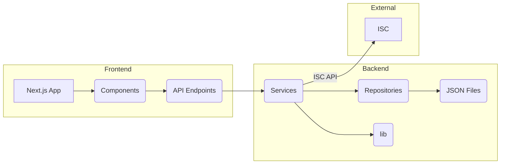

# Data Flow

This document describes the overall data flow of the application.

## Overall Data Flow

The application manages data related to events, players, matches, rankings, categories, and statistics. The data flow can be visualized as follows:

**Explanation:**

-   **Frontend:** The Next.js application (A) uses components (B) to render the UI. These components interact with the backend through API endpoints (C).
-   **Backend:** The API endpoints (C) use service classes (D) to perform operations. The services use repository classes (E) to access and modify data stored in JSON files (F). The services also utilize core logic from the `lib` directory (G).
-   **External:** The `MatchService` and `ISCService` interact with the ISC API (H) to validate match results and fetch data.
-   **Data Flow:** Data flows from the JSON files (F) to the frontend (A) through the repositories, services, and API endpoints. Data also flows from the frontend to the backend when users interact with the application (e.g., submitting match results, creating events). The ISC API is used to validate match data and fetch match results.

## Data Sources

The application primarily uses JSON files located in the `data` directory to store data:

-   `data/events.json`: Stores event data.
-   `data/players.json`: Stores player data.
-   `data/matches/{eventId}/{round}.json`: Stores match results for each event and round.
-   `data/rankings/{eventId}/{round}.json`: Stores event-specific rankings for each round.

## Services and Repositories

The application uses a service-repository pattern to manage data access and business logic.

### EventService

-   **Purpose:** Manages event-related operations.
-   **Repository:** `EventRepository`
-   **Methods:**
    -   `getEvents`: Retrieves all events.
    -   `getEvent`: Retrieves a specific event by ID.
    -   `createEvent`: Creates a new event.
    -   `generatePairingsForRound`: Generates pairings for a specific round of an event.
    -   `getRounds`: Retrieves all rounds for a specific event.

### PlayerService

-   **Purpose:** Manages player-related operations.
-   **Repository:** `PlayerRepository`
-   **Methods:**
    -   `getPlayers`: Retrieves all players.
    -   `getPlayer`: Retrieves a specific player by ID.
    -   `recalculatePlayers`: Recalculates player statistics and ratings.

### MatchService

-   **Purpose:** Manages match-related operations.
-   **Repository:** `MatchRepository`
-   **Methods:**
    -   `getMatchesByEventId`: Retrieves matches for a specific event.
    -   `processMatchResult`: Processes the result of a match, updates player ratings, and updates match data.
    -   `modifyMatch`: Modifies an existing match.

### RankingService

-   **Purpose:** Manages ranking-related operations.
-   **Repository:** `RankingRepository`, `PlayerRepository`
-   **Methods:**
    -   `getRoundRankings`: Retrieves rankings for a specific event and round.
    -   `updateRoundRankings`: Updates the rankings for a specific event and round.
    -   `getGlobalRankings`: Retrieves the global rankings.
    -   `updateGlobalRankings`: Calculates and updates the global rankings.

### StatisticsService
-  **Purpose:** Manages statistics related operations
- **Repository:** `EventRepository`
- **Methods:**
 - `getEventStatistics`: Retrieves statistics for a specific event.

### CategoryService
- **Purpose:** Manages category related operations
- **Repository:** `PlayerRepository`
- **Methods:**
 - `recalculateCategories`: Recalculates the categories of all players.

### ISCService

- **Purpose:** Interacts with the ISC API.
- **Repository:** None
- **Methods:**
    - `fetchMatchResult`: Fetches match results from the ISC API.

## Frontend Interaction

The frontend (Next.js application) interacts with the backend through API endpoints. These endpoints are defined in the `src/app/api` directory. The frontend uses various components (located in `src/app/components` and `src/components`) to render the UI and display data fetched from the API.