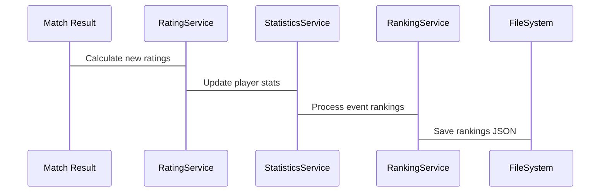
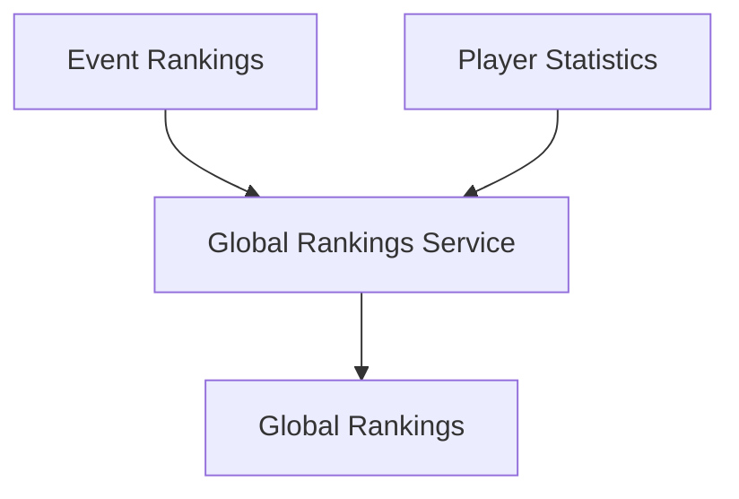

# Dual Ranking System Architecture Documentation

## 1. Event Rankings Flow

### Data Processing Pipeline


### API Endpoints
1. GET `/api/rankings/[eventId]`
- Returns: EventRanking object
- Caching: File-based with recalculation fallback
- Error handling: 500 for system errors

2. POST `/api/rankings/[eventId]`
- Purpose: Force ranking recalculation
- Authorization: Required
- Returns: Updated EventRanking

### Data Model
```typescript
EventRanking {
  eventId: string
  lastUpdated: string
  rankings: PlayerRanking[]
}

PlayerRanking {
  playerId: string
  rank: number
  points: number
  matches: number
  rating: number
  ratingChange: number
  category: string
  playerDetails: {...}
}
```

### Performance Optimizations
- File-based caching with atomic writes
- Batch processing for multiple matches
- O(1) player performance lookups
- Efficient tie handling algorithm

## 2. Global Rankings Flow

### Calculation Methodology
- Aggregates player statistics across all events
- Uses weighted rating system based on:
  - Current rating
  - Win ratio
  - Total matches played

### Data Integration


### API Interface
1. GET `/api/rankings/global`
- Returns: Global ranking list
- Performance: Cached calculation
- Error handling: 500 for failures

### Statistical Processing
```typescript
Service Boundaries:
- RatingService: ELO calculations
- StatisticsService: Performance metrics
- RankingService: Ranking aggregation
```

### Monitoring Points
1. Rating Calculations
- Input validation
- Rating bounds checking
- K-factor appropriateness

2. Statistical Processing
- Performance metrics
- Data consistency
- Calculation accuracy

3. API Performance
- Response times
- Error rates
- Cache hit ratios

### SLA Targets
- API Response: < 200ms
- Ranking Updates: < 30s
- Data Consistency: 100%
- System Availability: 99.9%

### Error Handling
1. Data Validation
- Match result validation
- Rating bounds protection
- Category validation

2. Processing Errors
- Automatic retries
- Fallback calculations
- Error logging and monitoring

3. System Recovery
- Atomic file operations
- Ranking recalculation
- Data consistency checks

### Scalability Considerations
1. Performance
- File-based caching
- Incremental updates
- Batch processing

2. Data Storage
- JSON file organization
- Atomic writes
- Directory structure

3. API Optimization
- Route caching
- Response compression
- Query optimization