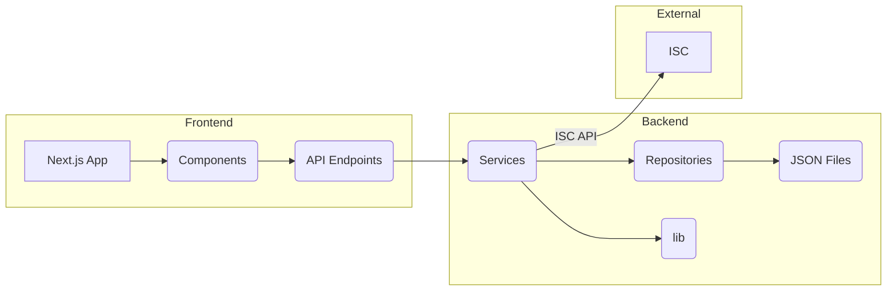

# Data Flow and Ranking System

This document describes the data flow of the application, with a particular focus on how player rankings are calculated and updated.

## Overall Data Flow

The application manages data related to events, players, matches, and rankings. The data flow can be visualized as follows:

**Explanation:**

-   **Frontend:** The Next.js application (A) uses components (B) to render the UI. These components interact with the backend through API endpoints (C).
-   **Backend:** The API endpoints (C) use service classes (D) to perform operations. The services use repository classes (E) to access and modify data stored in JSON files (F). The services also utilize core logic from the `lib` directory (G).
-   **External:** The `MatchService` interacts with the ISC API (H) to validate match results.
-   **Data Flow:** Data flows from the JSON files (F) to the frontend (A) through the repositories, services, and API endpoints. Data also flows from the frontend to the backend when users interact with the application (e.g., submitting match results). The ISC API is used to validate match data.

## Ranking-Specific Data Flow

The ranking system is a crucial part of the application. Here's a breakdown of how it works:

1.  **Data Sources:**
    -   Player data (including ratings) is stored in `data/players.json`.
    -   Match results are stored in `data/matches/{eventId}/{round}.json`.
    -   Event-specific rankings are stored in `data/rankings/{eventId}/{round}.json`.

2.  **Ranking Calculation:**
    -   The `RankingService` is responsible for calculating and updating rankings.
    -   It uses the `RatingSystem` (from `src/lib/RatingSystem.ts`) to calculate rating changes based on match results.  The rating system is based on the Elo rating system.
    -   It uses the `MatchManager` (from `src/lib/MatchManager.ts`) to determine the expected outcome of a match.
    -   `RankingService.updateRoundRankings` updates the rankings for a specific event and round.
    -   `RankingService.getRoundRankings` retrieves the rankings for a specific event and round.
    -   `RankingService.updateGlobalRankings` calculates and updates the global rankings based on all player data.
    -   `RankingService.getGlobalRankings` retrieves the global rankings.

3.  **API Endpoints:**
    -   `/api/rankings/{eventId}?round={round}` (GET): Retrieves event-specific rankings.
    -   `/api/rankings/{eventId}` (POST): Forces an update of event-specific rankings.
    -   `/api/rankings/global` (GET): Retrieves global rankings.
    -   `/api/rankings/global` (POST): Updates global rankings.

4.  **Frontend Display:**
    -   The `RankingsPage` component (`src/app/rankings/page.tsx`) displays the global rankings.
    -   The `ClientEventTabs` component (`src/app/components/ClientEventTabs.tsx`) likely displays event-specific rankings within the event details page.
    -   The `PlayerRankings` component (`src/app/components/PlayerRankings.tsx`) is used to render the ranking tables.

5. **Global Ranking Update:**
    - The `/api/rankings/global` endpoint (POST method) triggers a recalculation of the global rankings. This ensures that the global rankings are up-to-date. The frontend calls this endpoint before retrieving the global rankings.