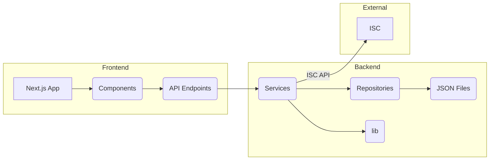
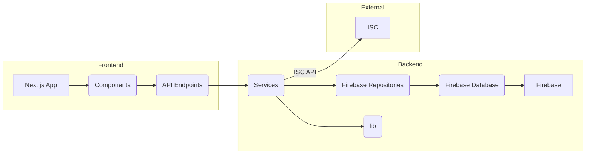

# Firebase Migration Plan

This document outlines the plan for migrating the web application's data storage from JSON files to Firebase. It covers the architectural modifications, the proposed Firebase data structure, and the rationale behind the design choices.

## 1. Architectural Modifications

The primary change in the application architecture involves replacing the file system-based data access with Firebase SDK calls. This means modifying the repository classes to interact with Firebase instead of reading and writing JSON files.

**Current Data Flow:**

**Proposed Data Flow:**

**Specific Changes:**

*   **Repository Classes:** The `EventRepository`, `PlayerRepository`, `MatchRepository`, and `RankingRepository` classes will be modified.  Their methods (e.g., `getAll`, `getById`, `create`, `update`) will be reimplemented to use the Firebase SDK for data operations (reading, writing, updating, and deleting data in the Firebase database).  This involves replacing file I/O operations with Firebase's API calls.
*   **Services:** The service classes (`EventService`, `PlayerService`, `MatchService`, `RankingService`, `StatisticsService`, `CategoryService`) will remain largely unchanged in terms of their public interface.  However, they will now call the modified repository methods that interact with Firebase.  The business logic within the services will remain the same.
*   **API Endpoints:** The API endpoints (`src/app/api/...`) will remain the same, as they already interact with the service layer. The underlying data access mechanism will change (from JSON files to Firebase), but the API interface and contracts will not.
*   **Category Calculation:** The `CategoryService` will be modified. Instead of relying on stored category data, it will calculate the player's category dynamically based on their current rating. This eliminates the need to store and update the category separately.  A utility function (likely within the `lib` directory) will be created to encapsulate the category calculation logic.
* **Real-time Updates:** Firebase's real-time capabilities will be leveraged to provide instant updates to the UI. Specifically:
    *   **Player Ratings:**  When a match result is processed, the affected players' ratings will be updated in real-time in the application.
    *   **Match Status:** Changes to match status (e.g., from "pending" to "completed" or "validated") will be reflected in real-time.
    * **Rankings:** When rankings are updated, the changes will be reflected in real-time.

## 2. Firebase Data Structure

The proposed Firebase data structure utilizes a NoSQL, document-oriented approach, leveraging Firebase's strengths for scalability and real-time updates.

**Collections:**

*   **`events`:** Stores event data.
    *   `{eventId}` (document)
        *   `id`: `string` (unique identifier, e.g., "mentoring-league-2025-02")
        *   `name`: `string` (e.g., "Mentoring League")
        *   `startDate`: `timestamp`
        *   `endDate`: `timestamp`
        *   `type`: `string` (e.g., "initial-random-pairing")
        *   `status`: `string` (e.g., "in_progress", "completed")
        *   `metadata`: `object` (additional event information)
            *   `description`: `string`
            *   `location`: `string`
            *   `totalPlayers`: `number`
            *   `totalMatches`: `number`
            *   `currentRound`: `number`
            *   `totalRounds`: `number`
            *   `lastUpdated`: `timestamp`
*   **`players`:** Stores player data.
    *   `{playerId}` (document)
        *   `id`: `string` (unique identifier, e.g., "elie-2025")
        *   `name`: `string` (e.g., "Elie")
        *   `iscUsername`: `string` (e.g., "Colin22")
        *   `currentRating`: `number` (e.g., 980)
        *   `statistics`: `object`
            *   `totalMatches`: `number`
            *   `wins`: `number`
            *   `draws`: `number`
            *   `losses`: `number`
            *   `forfeits`: `object`
                *   `given`: `number`
                *   `received`: `number`
            *   `totalPR`: `number`
            *   `averageDS`: `number`
            *   `inactivityWeeks`: `number`
            *   `bestRating`: `number`
            *   `worstRating`: `number`
            *   `eventParticipation`: `array` of `object`
                *   `eventId`: `string`
                *   `finalRank`: `number`
                *   `matchesPlayed`: `number`
                *   `performance`: `object`
                    *   `wins`: `number`
                    *   `draws`: `number`
                    *   `losses`: `number`
                    *   `pointsEarned`: `number`

*   **`matches`:** Stores match data.
    *   `{matchId}` (document)
        *   `id`: `string` (unique identifier, e.g., "match-1")
        *   `eventId`: `string` (references the `events` collection)
        *   `round`: `number`
        *   `date`: `timestamp`
        *   `player1`: `object`
            *   `id`: `string` (references the `players` collection)
            *   `ratingBefore`: `number`
            *   `ratingAfter`: `number`
        *   `player2`: `object`
            *   `id`: `string` (references the `players` collection)
            *   `ratingBefore`: `number`
            *   `ratingAfter`: `number`
        *   `status`: `string` (e.g., "pending", "completed", "forfeit", "validated")
        *   `result`: `object`
            *   `score`: `array` (`number`, `number`)
            *   `pr`: `number`
            *   `pdi`: `number`
            *   `ds`: `number`
            *   `validation`: `object`
                *   `timestamp`: `timestamp`
                *   `status`: `string`
        *   `metadata`: `object` (additional match information)

**Note:** The `player1Approved` and `player2Approved` fields were removed from the `matches` collection as per user feedback, as they are not used in the current application logic.

* **`rankings`:** Stores ranking data per event and round.
    *   `{eventId}_{round}` (document): The document ID combines eventId and round for easy querying.
        *   `eventId`: `string`
        *   `round`: `number`
        *   `lastUpdated`: `timestamp`
        *   `rankings`: `array` of `object`
            *   `playerId`: `string` (references the `players` collection)
            *   `rank`: `number`
            *   `points`: `number`
            *   `matches`: `number`
            *   `wins`: `number`
            *   `draws`: `number`
            *   `losses`: `number`
            *   `rating`: `number`
            *   `ratingChange`: `number`

**Rationale:**

*   **Normalization:** Match data is stored separately from player data, eliminating redundancy.  Player and event documents are referenced by ID in the `matches` and `rankings` collections.
*   **Efficient Queries:** The structure is optimized for common queries:
    *   Fetching all events:  Query the `events` collection.
    *   Fetching a specific event:  Retrieve the document in `events` with the corresponding `eventId`.
    *   Fetching all players: Query the `players` collection.
    *   Fetching a specific player: Retrieve the document in `players` with the corresponding `playerId`.
    *   Fetching matches for an event: Query the `matches` collection, filtering by `eventId`.
    *   Fetching matches for a specific round of an event: Query the `matches` collection, filtering by `eventId` and `round`.
    *   Fetching rankings for an event and round: Retrieve the document in `rankings` with the ID `{eventId}_{round}`.
*   **Real-time Updates:**  Firebase's real-time capabilities will be used to update player ratings, match status, and rankings as changes occur.
* **Scalability:** Firebase's NoSQL database is designed for scalability, handling large amounts of data and high traffic.

## 3. Migration Steps
1. **Set up Firebase:** Create a Firebase project and configure the necessary credentials for the application.
2. **Implement Firebase Repositories:** Modify the existing repository classes (`EventRepository`, `PlayerRepository`, `MatchRepository`, `RankingRepository`) to use the Firebase SDK.
3. **Update Services:** Update the service classes to use the new Firebase repositories.
4. **Data Migration Script:** Create a script to migrate the existing data from the JSON files to the new Firebase data structure. This script will read the JSON files, transform the data to the new format, and write it to Firebase.
5. **Testing:** Thoroughly test the application with the new Firebase integration, including data retrieval, updates, real-time updates, and the ISC API integration.
6. **Deployment:** Deploy the updated application with Firebase integration.
7. **Category Calculation Logic:** Implement the logic to calculate player categories based on ratings within a utility function. Update the `CategoryService` to use this function.

This plan provides a comprehensive approach to migrating the application to Firebase, ensuring data integrity, efficiency, and real-time capabilities.
