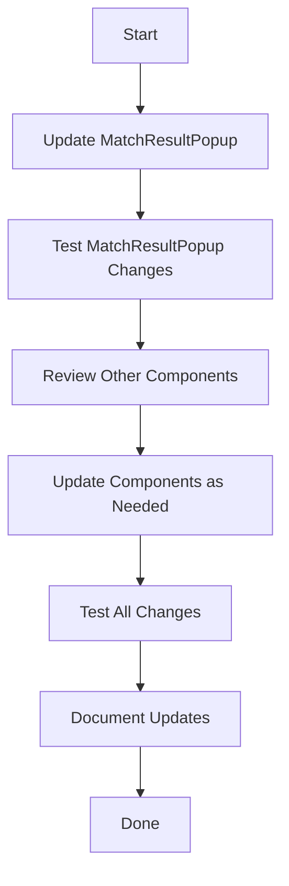

# ISC Username Display Implementation Plan

## Overview

The plan focuses on enhancing the UI components to properly display ISC usernames for players where available. The core infrastructure for ISC usernames is already in place:

- The Player type includes `iscUsername`
- The ISC service correctly prioritizes `iscUsername` over `iscId`
- The API routes handle ISC identifiers properly
- The `players.json` data file already includes `iscUsername` fields

## Implementation Steps

### 1. Modify MatchResultPopup Component

#### Update Player Map
Modify the `useEffect` hook in `MatchResultPopup.tsx` to include the `iscUsername` field when building the players map:

```typescript
const playersMap = data.reduce((acc: { [key: string]: { id: string; name: string; iscUsername?: string } }, player: any) => {
  acc[player.id] = {
    id: player.id,
    name: player.name,
    iscUsername: player.iscUsername
  };
  return acc;
}, {});
```

#### Update Name Display Logic
Modify the `getPlayerName` function to prioritize `iscUsername`:

```typescript
const getPlayerName = (playerId: string) => {
  const player = players[playerId];
  return player?.iscUsername || player?.name || playerId.replace(/-\d+$/, '');
};
```

#### Enhance UI Display
Add ISC username display below the player's name in parentheses:

```typescript
<Label className={`text-lg ${matchResult && winner === matchResult.player1.name ? 'font-bold text-blue-600' : ''}`}>
  {matchResult ? getPlayerName(matchResult.player1.name) : getPlayerName(player1Name)}
</Label>
{players[matchResult ? matchResult.player1.name : player1Name]?.iscUsername && (
  <div className="text-sm text-gray-500">
    (ISC: {players[matchResult ? matchResult.player1.name : player1Name].iscUsername})
  </div>
)}
```

### 2. Review Other UI Components

Examine the following components to ensure consistent display of ISC usernames:

- `EventMatchHistory.tsx`
- `PlayerMatchHistory.tsx`
- `PlayerProfileError.tsx`
- `PlayerRankings.tsx`
- `PlayerStats.tsx`
- `HeadToHeadStats.tsx`

For each component:
1. Check if it displays player names
2. If yes, update it to show ISC usernames using the same pattern as `MatchResultPopup`
3. Ensure consistent styling across components

### 3. Future Considerations

After the UI updates are complete, consider:

- Updating admin interfaces to manage ISC usernames
- Adding data validation for ISC username format
- Implementing data migration tools if needed
- Adding ISC username fields to player creation/edit forms

## Implementation Flow



## Success Criteria

- ISC usernames are displayed consistently across all relevant components
- The UI clearly distinguishes between player names and ISC usernames
- The display pattern is consistent with the existing UI design
- Changes maintain backward compatibility for players without ISC usernames