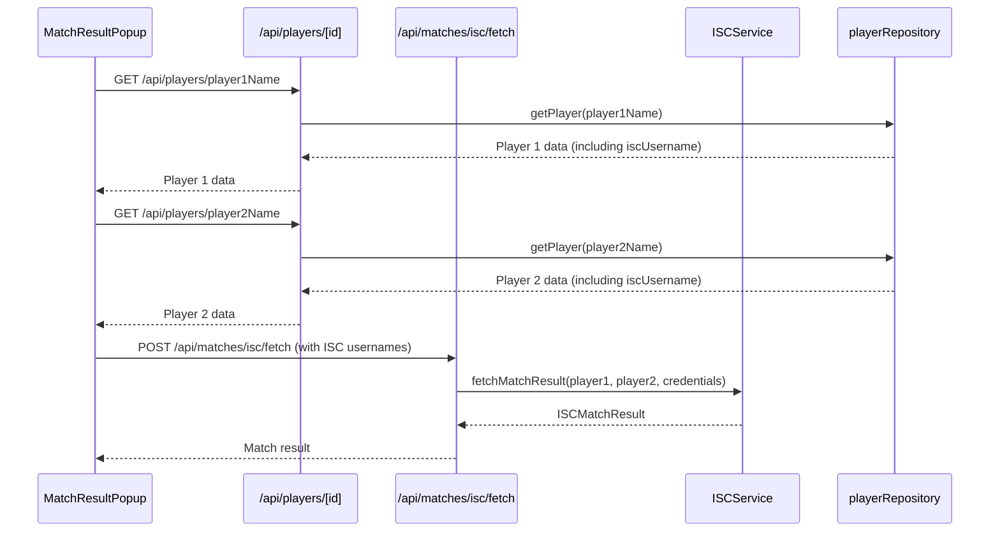

# ISC Username Fetch and API Integration Plan

## Overview

This plan outlines the changes needed to correctly fetch and use ISC usernames when retrieving match results from ISC. It addresses the issue where the application was not consistently using ISC usernames, leading to failed API calls.

## Current Architecture

Currently, the `MatchResultPopup` component attempts to fetch all player data upfront using a non-existent `/api/players` endpoint. This approach is inefficient and unnecessary, as we only need the ISC username for the two players involved in the match.

## Proposed Architecture

We will leverage the existing `/api/players/[id]` endpoint to fetch individual player details, including the ISC username, as needed. This avoids loading all player data unnecessarily. We will also create a new endpoint `/api/players` to provide a way to get all players for other components that might need it.



## Implementation Steps

1.  **Create `/api/players/route.ts`:**

    This new endpoint will handle GET requests to retrieve all players. It will use the existing `PlayerRepository` to fetch player data from `players.json` and return a JSON response containing an array of player objects. Error handling will be included.

    ```typescript
    // src/app/api/players/route.ts
    import { NextResponse } from 'next/server';
    import { PlayerRepository } from '@/api/repository/playerRepository';

    const playerRepo = new PlayerRepository();

    export async function GET() {
      try {
        const players = await playerRepo.getAllPlayers();
        return NextResponse.json({ players });
      } catch (error) {
        console.error("Error fetching players:", error);
        return NextResponse.json(
          { error: 'Failed to fetch players' },
          { status: 500 }
        );
      }
    }
    ```

2.  **Modify `MatchResultPopup.tsx`:**

    *   Remove the `players` state and the `useEffect` hook that fetches all players.
    *   Create an asynchronous helper function `fetchPlayerDetails` to fetch individual player data using the existing `/api/players/[id]/route.ts` endpoint.
    *   Within the `onClick` handler for the "Fetch from ISC" button:
        *   Call `fetchPlayerDetails` for both `player1Name` and `player2Name`.
        *   Use the returned player data to access the `iscUsername` for each player.
        *   Pass the `iscUsername` (if available, otherwise fall back to player ID) in the request body to `/api/matches/isc/fetch`.

    ```typescript
    // In MatchResultPopup.tsx

    // Helper function to fetch individual player details
    const fetchPlayerDetails = async (playerId: string) => {
      const response = await fetch(`/api/players/${playerId}`);
      if (!response.ok) {
        throw new Error(`Failed to fetch details for player: ${playerId}`);
      }
      return response.json();
    };

    // ... (inside the component)

    // In the onClick handler for the "Fetch from ISC" button:
    const player1Details = await fetchPlayerDetails(player1Name);
    const player2Details = await fetchPlayerDetails(player2Name);

    const response = await fetch('/api/matches/isc/fetch', {
      method: 'POST',
      headers: { 'Content-Type': 'application/json' },
      body: JSON.stringify({
        player1: {
          iscId: player1Name, // Keep the ID for internal use
          iscUsername: player1Details.iscUsername // Use the fetched ISC username
        },
        player2: {
          iscId: player2Name, // Keep the ID for internal use
          iscUsername: player2Details.iscUsername // Use the fetched ISC username
        }
      })
    });
    ```
    * Update the `PlayerNameDisplay` component usage to use the `getPlayerId` helper function.

3.  **Update `PlayerNameDisplay` component:**

    *   Modify the props to accept `name` and `iscUsername` directly, instead of `playerId` and a `players` map.
    *   Update the component to display the ISC username if available, otherwise fall back to the name.

4.  **Update usages of `PlayerNameDisplay`:**

    *   In `MatchResultPopup.tsx`, pass `name` and `iscUsername` directly.
    *   In `EventMatchHistory.tsx`, pass `name` and `iscUsername` from `player1Details` and `player2Details`.
    *   In `PlayerMatchHistory.tsx`, pass `name` and `iscUsername` from `match.player1Details` and `match.player2Details`.
    *   In `EventRoundPairings.tsx`, pass `name` and `iscUsername` from `match.player1Details` and `match.player2Details`.

5.  **Update `src/types/MatchHistory.ts`:**

    *   Add `iscUsername` to the `PlayerDetails` interface.

6.  **Update `src/api/services/ISCService.ts`:**

    *   Ensure that `fetchMatchResult` uses the `iscUsername` for all ISC API calls.
    *   Add error handling to throw an error if `iscUsername` is missing for either player.

7.  **Testing:**

    *   Test fetching match results for players with and without ISC usernames.
    *   Verify that the UI displays the correct information.
    *   Verify that the ISC API calls use the correct usernames.

## Success Criteria

-   The application correctly fetches match results from ISC using ISC usernames.
-   The `MatchResultPopup` component displays ISC usernames when available.
-   The application handles cases where ISC usernames are missing.
-   The code is clean, efficient, and follows best practices.
-   The changes are well-documented.