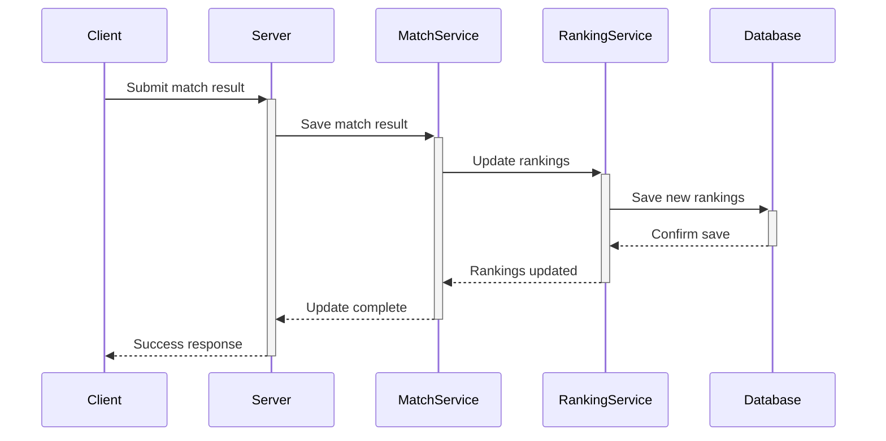

# Match Result Submission and Ranking Updates Plan

## Current Issues
1. No proper UI for submitting match results
2. Rankings not automatically updated after match results
3. On-demand ranking generation is inefficient
4. Inconsistency between match data and rankings

## Proposed Solution

### 1. Match Result Form Component
Create a proper form to submit match results that includes:
- Score inputs for both players
- PR (Points Ranking) calculation
- PDI (Point Difference Index) calculation 
- DS (Dominant Score) calculation
- Validation status tracking
- Player approval workflow

### 2. Match Result Submission Flow
1. User fills out match result form
2. On submission:
   - Update match status to completed
   - Calculate PDI, DS based on scores
   - Send data to `/api/matches/result` endpoint
   - Trigger ranking update automatically

### 3. Automatic Ranking Updates
When a match result is submitted:
1. Save match result
2. Call RankingService to:
   - Recalculate rankings for all players
   - Update player ratings
   - Generate new ranking file
3. Send notifications to affected players

### 4. API Endpoints Structure
```
POST /api/matches/result
- Submit match result
- Validate input
- Update match
- Trigger ranking update

GET /api/rankings/[eventId]
- Return current rankings
- No more on-demand generation
```

### 5. Rankings Update Flow


## Implementation Steps

1. Create MatchResultForm Component:
   - Add to src/app/components/MatchResultForm.tsx
   - Include all required fields and calculations
   - Add validation

2. Update MatchService:
   - Add methods for result submission
   - Include rating calculations
   - Add validation logic

3. Update RankingService:
   - Move from on-demand to event-driven updates
   - Improve performance of ranking calculations
   - Add backup of previous rankings

4. Update API Routes:
   - Enhance error handling
   - Add validation middleware
   - Implement proper status codes

5. Add Tests:
   - Unit tests for calculations
   - Integration tests for submission flow
   - E2E tests for full process

## UI Updates
- Add match result form to match details page
- Show submission status and validation state
- Display updated rankings immediately after submission
- Add loading states during updates

## Security & Validation
- Validate all input on client and server
- Ensure only authorized users can submit results
- Add rate limiting for submissions
- Implement proper error handling

## Migration
- Create migration script for existing matches
- Generate initial rankings for all events
- Add data validation for existing records