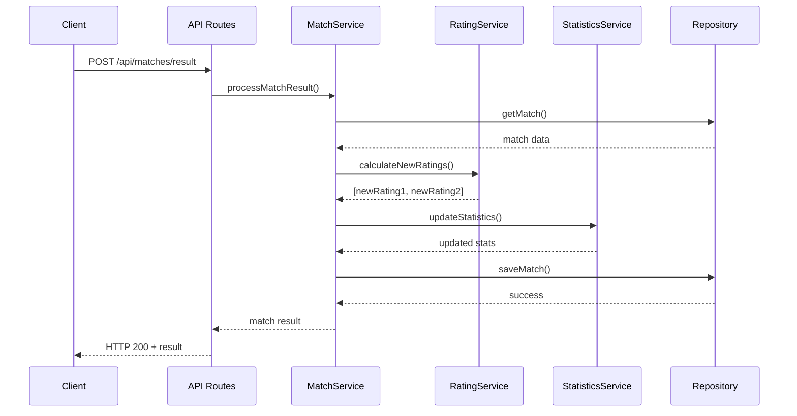
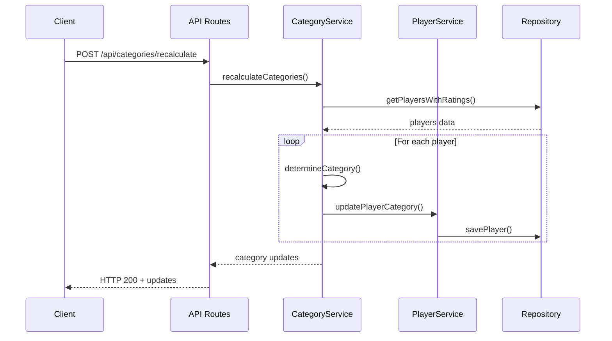
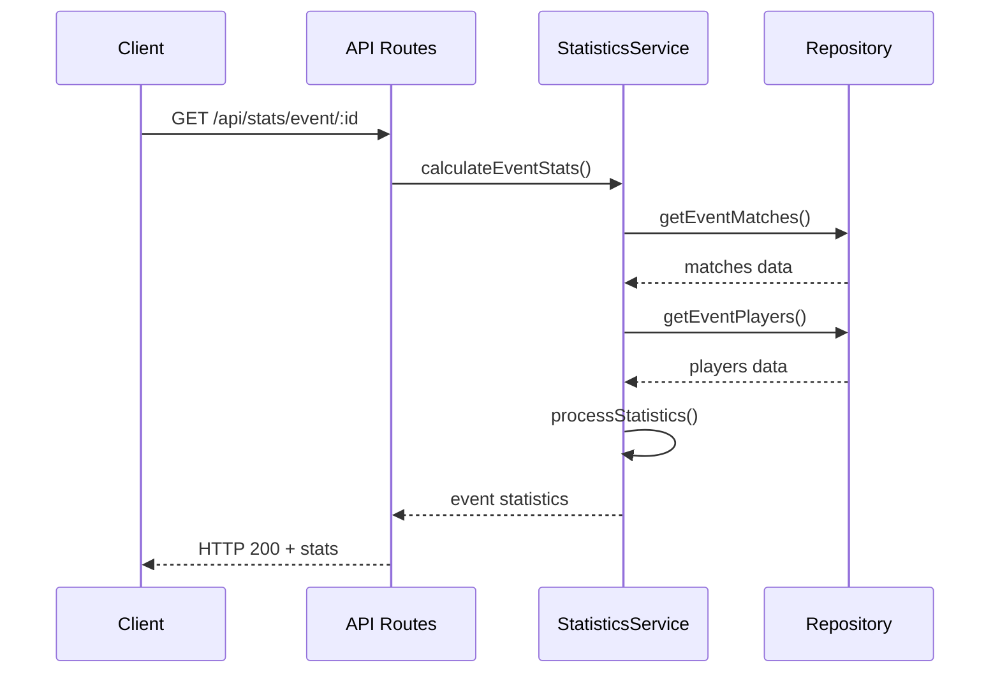
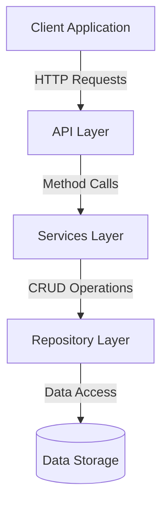
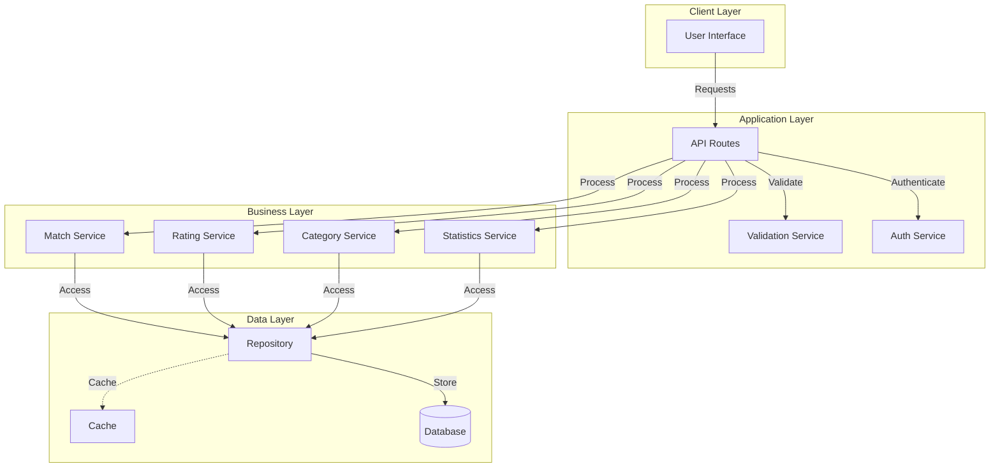

# System Design - Rating System

## Sequence Diagrams

### 1. Match Processing Flow

### 2. Category Management Flow

### 3. Statistics Calculation Flow

## Component Interaction Diagram

## Data Flow Diagram

## Notes

1. **Error Handling**
   - Each service includes error handling and validation
   - Failed operations trigger rollbacks where appropriate
   - All errors are logged and monitored

2. **Performance Considerations**
   - Rating calculations are performed asynchronously
   - Statistics are cached and updated periodically
   - Database queries are optimized for large datasets

3. **Security**
   - All endpoints require authentication
   - Role-based access control for sensitive operations
   - Input validation at multiple layers

4. **Scalability**
   - Services are designed to be stateless
   - Repository pattern enables easy database switching
   - Caching strategy reduces database load